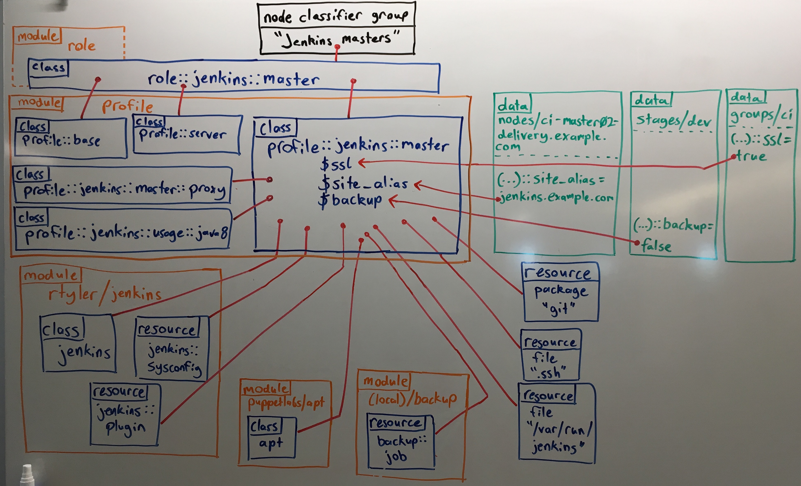

[module]: TODO
[class]: TODO
[environment.conf]: TODO
[hiera]: TODO
[puppet lookup]: TODO
[auto_params]: TODO
[lookup_function]: TODO
[main manifest]: TODO
[resource-like]: TODO
[rtyler/jenkins]: TODO
[puppetlabs/apt]: TODO


Typically, your goal with Puppet is to build _complete system configurations_, which manage all of the software, services, and configuration that you care about on a given system.

Building system configurations can be challenging --- mostly because the systems you manage are complicated. To keep that complexity under control, your code needs to be reusable, easy to configure, and easy to refactor.

The **roles and profiles** method is Puppet's approach for building reusable, configurable, and refactorable system configurations. It's not a straightforward recipe: you must think hard about the nature of your infrastructure and your team. It's also not a final state: expect to refine your configurations over time. Instead, it's an approach to _designing your infrastructure's interface_ --- sealing away incidental complexity, surfacing the significant complexity, and making sure your data behaves predictably.

## The roles and profiles architecture

Roles and profiles are **two extra layers of indirection** between your node classifier and your component modules.

> **Note:** A component module is a normal module that manages one technology. See the [glossary][] below.

These extra layers of indirection might seem like they add complexity, but they give you a space to build practical, business-specific interfaces to the configuration you care most about. A better interface makes hierarchical data easier to use, makes system configurations easier to read, and makes refactoring easier.



In short, from top to bottom:

* Your node classifier assigns one **role** class to a group of nodes. The role manages a whole system configuration, so no other classes are needed. The NC does not configure the role in any way.
* That role class declares some **profile** classes with `include`, and does nothing else. For example:

  ``` puppet
  class role::jenkins::master {
    include profile::base
    include profile::server
    include profile::jenkins::master
  }
  ```

* Each profile configures a layered technology stack, using multiple component modules and the built-in resource types. In the diagram, `profile::jenkins::master` uses [rtyler/jenkins][], [puppetlabs/apt][], a home-built backup module, and some `package` and `file` resources.
* Profiles can take configuration data from Hiera or Puppet lookup. For example, in the diagram ...
* Component modules --- normal modules that each manage one technology --- are only used in the following ways:
    * Component classes are always declared via a profile, and never assigned directly to a node.
    * If they have class parameters, you specify them in the _profile_; never use Hiera or Puppet lookup to override component class params.

### Building configurations without roles and profiles

Without roles and profiles, people typically build system configurations in their node classifier or [main manifest][], using Hiera to handle tricky inheritance problems. A standard approach is to create a group of similar nodes and assign classes to it, then create child groups with extra classes for nodes that have additional needs. Another common pattern is to put everything in Hiera, using a very large hierarchy that reflects every variation in the infrastructure.

If this works for you, then it works! You might not need roles and profiles. But most people find direct building gets difficult to understand and maintain over time.

## Glossary of terms

[glossary]: #glossary-of-terms

* **Node classifier:** A tool that assigns classes to nodes. Generally means the Puppet Enterprise console, but can also be the [main manifest][] or Hiera.
* **Component module:** A normal module that manages one particular technology. They're usually named after the software they manage (puppetlabs-apache, etc.), and are often written by third parties and published on the Puppet Forge.

    In general, component modules are highly configurable, especially Forge modules that must serve a wide variety of people and needs. Their classes tend to have a lot of parameters.
* **Profile:** A business-specific wrapper class that configures a layered technology stack (which might involve several pieces of software). They usually take advantage of classes and resources from several different component modules.

    Profiles should have only a small amount of configuration, since they're already written to support your particular needs.

    Profile classes should all be stored in one module, named `profile`.
* **Role:** A business-specific wrapper class that builds a complete system configuration by declaring one or more profiles.

    Roles should have no configuration. They should all be stored in a single module, named `role`.


